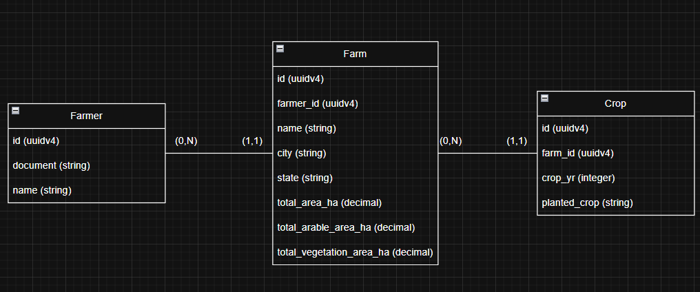

## Descrição

Este projeto backend foi desenvolvido em **NestJS** para gerenciar o cadastro de produtores rurais. A arquitetura está seguindo os princípios da **arquitetura hexagonal** para garantir um padrão de design desacoplado e de fácil manutenção. A aplicação foi pensada sobre o conceito de **monolito modular**, dando abertura para a sua evolução, podendo até ser refatorada para a arquitetura de **microserviços**, caso seja necessário, devido à necessidade de escalar.

## Tecnologias

- **Framework**: NestJS
- **Linguagem**: Typescript
- **ORM**: Prisma
- **Banco de Dados**: PostgreSQL
- **Containerização**: Docker
- **Orquestração**: Docker Compose
- **Documentação**: Swagger/OpenAPI

## Arquitetura

### Diagrama - Monolito Modular (Arquitetura Hexagonal)


### Diagrama - Entidade e Relacionamento



## Como executar o projeto

Siga os passos abaixo para configurar e rodar a aplicação localmente.

#### Clone o repositório

```bash
$ git clone git@github.com:andR3Scr1pTx86/serasa_br_ag.git
```
#### Execute o comando do orquestrador

```bash
$ docker compose -f docker-compose.yml up -d

# Se o comando acima não funcionar, tente usar :

$ docker-compose -f docker-compose.yml up -d
```

#### A aplicação já vai estar executando !!!

[Acessar interface do usuário](http://localhost:3001/doc)

## Como executar os testes

Neste momento tem que rodar normalmente na sua maquina.

#### Testes Unitários & Testes de Integração

```bash
$ npm run test
```

#### Coverage

Para rodar os testes com cobertura, terá de subir o banco de dados de teste

```bash
$ npm run pretest
```

Depois de o container subir e o banco de dados estiver executando

```bash
$ npm run test:cov
```

Assim que acabar a execução, pode desligar o container

```bash
$ npm run posttest
```

## Nota

Este projeto foi desenvolvido como parte de um desafio técnico para a vaga de desenvolvedor backend (nodejs) na Serasa Experian (Brain-AG).