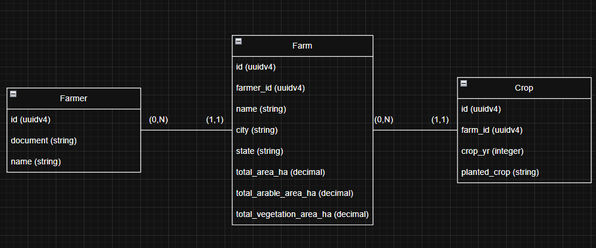

## Description

This backend project was developed in **NestJS** to manage the registration of rural producers. The architecture follows the principles of **Hexagonal Architecture** to ensure a decoupled design pattern and easy maintenance. The application was conceived under the **Modular Monolith** concept, allowing for future evolution; it can even be refactored into a **microservices** architecture if necessary due to scaling requirements.

## Technologies

- **Framework**: NestJS
- **Language**: TypeScript
- **ORM**: Prisma
- **Database**: PostgreSQL
- **Containerization**: Docker
- **Orchestration**: Docker Compose
- **Documentation**: Swagger/OpenAPI

## Architecture

### Diagram - Modular Monolith (Hexagonal Architecture)


### Diagram - Entity and Relationship



## How to run the project

Follow the steps below to configure and run the application locally.

#### Clone the repository

```bash
$ git clone git@github.com:andR3Scr1pTx86/serasa_br_ag.git
```
#### Execute the orchestrator command

```bash
$ docker compose -f docker-compose.yml up -d

# If the command above doesn't work, try using :

$ docker-compose -f docker-compose.yml up -d
```

#### The application will already be running !!!

[Access user interface](http://localhost:3001/doc)

## How to run the tests

At this point, it should run normally on your machine.

#### Unit Tests & Integration Tests

```bash
$ npm run test
```

#### Coverage

To run the tests with coverage, you will need to upload the test database.

```bash
$ npm run pretest
```

After the container starts up and the database is running

```bash
$ npm run test:cov
```

Once the execution is complete, you can shut down the container.

```bash
$ npm run posttest
```

## Note

This project was developed as part of a technical challenge for a backend developer (node.js) position at Serasa Experian (Brain-AG).
